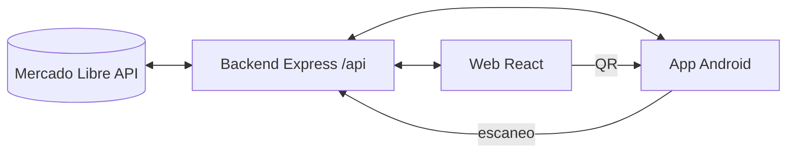

[](https://ml-manager-pro-jade.vercel.app)
[](https://github.com/julianmcancelo/fullpack/releases/latest)
[](https://github.com/julianmcancelo/fullpack/actions/workflows/ci.yml)
[](mobile/CONTRACT.md)
[](frontend/README.md)

# ML Pro Suite

Gestión integral de tu cuenta de **Mercado Libre** con datos 100% reales de la API oficial:

- **Stock y precios:** edición en vivo, variantes y publicaciones pausadas/activas.
- **Ventas:** historial, compradores, cobros, comisiones y neto acreditado, con aviso de venta nueva en tiempo real.
- **Logística:** Mercado Envíos (Flex, Colecta, Full, Correo) con etiquetas oficiales **PDF y ZPL térmica**, manifiesto de despacho y sincronización de estados.
- **Terminal de depósito:** escáner QR/barras en la web y en la **app Android** con modo ráfaga, linterna y verificación de despacho por transportista.



---

## Inicio rápido

Desde la raíz del proyecto:

```bash
npm run dev
```

Levanta **Backend** en `http://localhost:3001` y **Frontend** en `http://localhost:5173`.

## Conectar tu cuenta de Mercado Libre

### Opción A: OAuth 2.0 (recomendada)

1. Entrá al [DevCenter de Mercado Libre](https://developers.mercadolibre.com.ar/devcenter) y creá una aplicación.
2. En **Redirect URI** poné `http://localhost:3001/api/auth/callback` (o la URL de tu deploy + `/api/auth/callback`).
3. En la app, pestaña **Credenciales & Config**: pegá App ID y Secret, elegí tu país y conectá. Los tokens se auto-renuevan.

### Opción B: Access Token directo

En **Credenciales & Config → Método 2** pegá tu token `APP_USR-...` y vinculá.

> Las credenciales viven en variables de entorno (`ML_APP_ID`, `ML_CLIENT_SECRET`, `ML_REDIRECT_URI`, ver `.env.example`). Nunca se commitean secretos.

---

## Estructura

```
├── api/                # Entry point serverless (Vercel)
├── backend/            # Express: routes, services, Neon PostgreSQL + JSON local
├── frontend/           # React + Vite + Tailwind
├── mobile/             # App Android nativa (Kotlin + Compose, ver CONTRACT.md)
├── docs/banner.svg     # Banner del repo
├── vercel.json         # Deploy: frontend estático + /api/* serverless
└── firebase.json       # Google Sign-In (redirect URIs)
```

Un solo resumen canónico (`backend/src/services/overview.service.js`) alimenta al dashboard web y a la app móvil: mismos números en todos lados.

## App Android

Vinculás el celular escaneando el QR de la web (**Vincular celular**) y operás la terminal de empaque desde el depósito. La app avisa sola cuando hay una versión nueva (**Ajustes → Buscar actualizaciones**).

- 📲 Último APK: [Releases](https://github.com/julianmcancelo/fullpack/releases/latest)
- 📖 Contrato técnico: [mobile/CONTRACT.md](mobile/CONTRACT.md)

## Deploy

```bash
npx vercel --prod --yes   # siempre desde la raíz del repo
```

Producción: <https://ml-manager-pro-jade.vercel.app>
