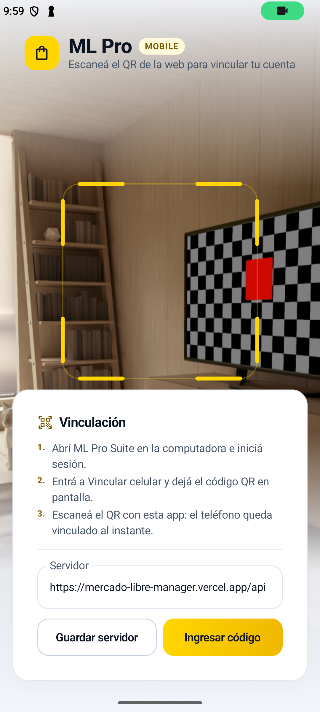
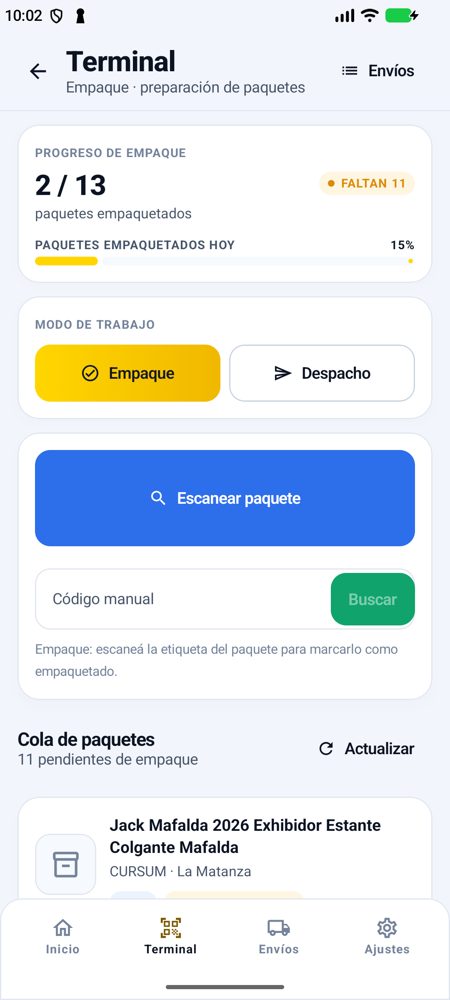
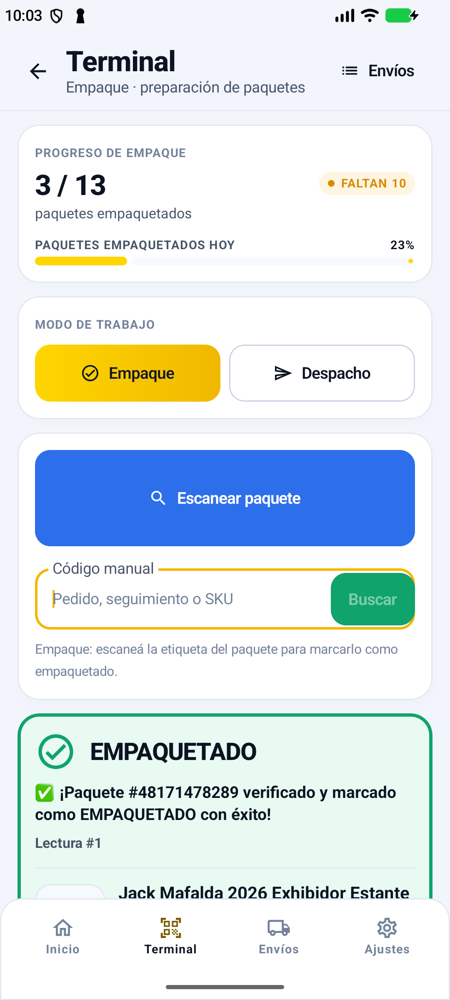
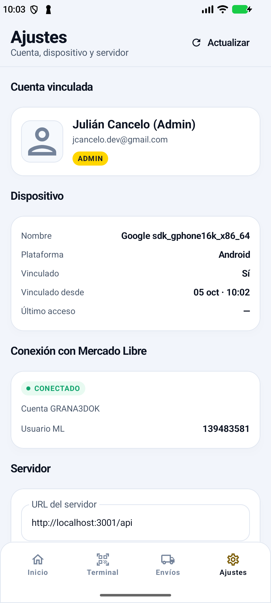
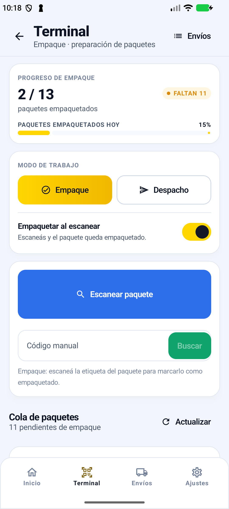
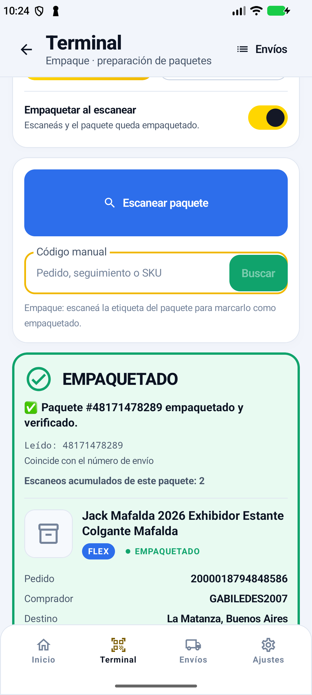
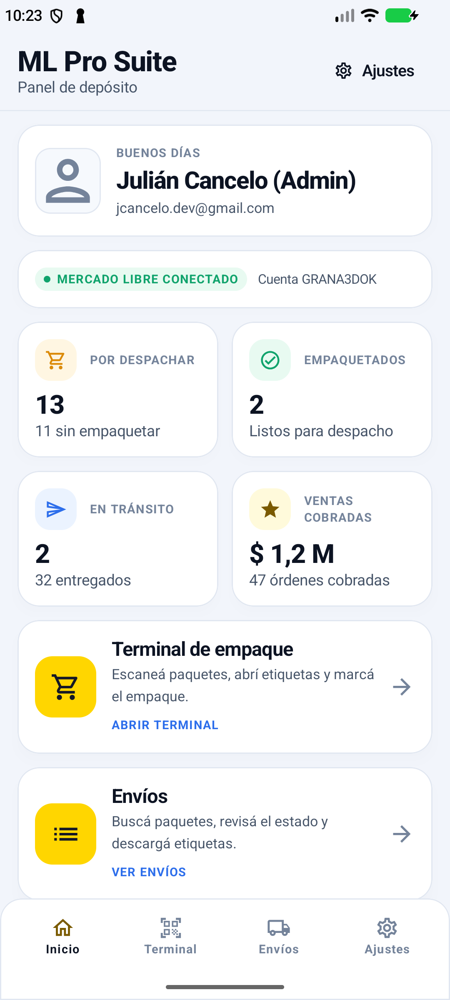

# ML Pro Mobile — app Android (Kotlin + Jetpack Compose)

App nativa que se vincula a tu cuenta de **ML Pro Suite** escaneando un código QR
desde la web, y opera la **terminal de empaque** desde el celular: escaneo de
paquetes, verificación, empaquetado, control de despacho, etiquetas y la cola de
trabajo del día.

---

## Cómo se vincula (flujo completo)

```
Web (sesión iniciada)                  Backend (Vercel)                Celular
─────────────────────                  ────────────────                ───────
POST /api/pair/create  ─────────────►  guarda sesión (código + secreto)
        │                                     │
        │  muestra el QR ◄────────────────────┘
        │  (contiene código, secreto y URL del API)
        │                                                           escanea el QR
        │                                     ◄────────────────── POST /api/pair/claim
        │                                     valida y emite el token de dispositivo
        │  GET /api/pair/status (polling) ──►  "claimed"
        └─ confirma "Vinculado con <celular>"                       guarda el token
                                                                     y opera
```

- El QR es de **un solo uso** y vence a los **10 minutos**.
- El celular **nunca** guarda credenciales de Mercado Libre: sólo un token de
  dispositivo (`X-Device-Token`) que se puede revocar desde la web.
- Si la cámara no puede escanear, la app permite **ingresar el código a mano**
  (`CODIGO:CLAVE`) o pegar el JSON del QR.

---

## Requisitos para compilar

| Pieza | Versión usada |
| --- | --- |
| JDK | 17 (`org.gradle.java.home` en `gradle.properties`) |
| Gradle | 8.14 |
| Android Gradle Plugin | 8.13.2 |
| Kotlin | 2.2.20 |
| compileSdk / targetSdk | 36 |
| minSdk | 24 |

### Compilar

```powershell
cd D:\ML\mobile
.\gradlew assembleDebug          # APK en app\build\outputs\apk\debug\
```

Si el wrapper todavía no existe (primera vez), generalo con el Gradle instalado:

```powershell
$env:JAVA_HOME = 'C:\Users\Julian\jdk-17'
& "$env:USERPROFILE\.gradle\wrapper\dists\gradle-8.14-all\*\gradle-8.14\bin\gradle.bat" wrapper --gradle-version 8.14
```

### Instalar en el celular

```powershell
adb install -r app\build\outputs\apk\debug\app-debug.apk
```

---

## Uso

1. En la web, entrá a **Vincular celular** (botón en la barra superior o tarjeta en
   *Credenciales & Config*).
2. Escaneá el QR con la app. Listo: el celular queda vinculado a tu usuario.
3. **Terminal**: escaneá el QR o código de barras de cada paquete. La app te dice con
   color, sonido y vibración si el paquete se empaquetó, si ya estaba empaquetado o
   si no corresponde (incluida la alerta de transportista equivocado en modo despacho).
4. **Envíos**: buscá y filtrá paquetes, mirá el detalle y descargá la etiqueta.
5. **Ajustes**: cambiá la URL del servidor, revisá el dispositivo y desvinculalo.

La URL del servidor es configurable para poder apuntar a un backend local
(`http://10.0.2.2:3001/api` desde el emulador, `http://<IP-de-la-PC>:3001/api` desde
un celular en la misma red).

---

## Verificación (hecha en esta máquina, no teórica)

APK compilado con `assembleDebug` (0 errores), instalado en un emulador Android 17
(1080×2400) y probado contra el backend real:

| Paso | Resultado |
| --- | --- |
| Instalar + abrir la app | Sin crashes; pide permiso de cámara y muestra el escáner |
| Crear sesión en la web/API | `POST /api/pair/create` → código de 6 caracteres |
| Vincular desde el celular | `status=claimed`, dispositivo `Google sdk_gphone16k_x86_64`, usuario `jcancelo.dev@gmail.com` |
| Pantalla de inicio | Datos reales de la tienda: 13 por despachar, 2 empaquetados, en tránsito 2, $1,2 M cobrados |
| Terminal de empaque | Escaneo del paquete `48171478289` → tarjeta verde **EMPAQUETADO**, progreso 2/13 → 3/13 |
| Ajustes | Cuenta, dispositivo, conexión con Mercado Libre y URL del servidor |

Capturas reales del emulador:

| Vinculación | Terminal | Resultado del escaneo | Ajustes |
| --- | --- | --- | --- |
|  |  |  |  |

> La app quedó apuntando a `http://localhost:3001/api` (backend local por `adb reverse`)
> en ese emulador. En un celular real, dejala en la URL de Vercel o en la IP de tu PC.

---

## Notas de mantenimiento

- **Nunca edites `backend/data/store.json` con `Set-Content -Encoding UTF8` de
  PowerShell 5.1**: agrega un BOM, `JSON.parse` falla, el servidor cae a los valores
  por defecto y el primer guardado **borra** la configuración, los tokens de Mercado
  Libre y el historial de empaque. Ya pasó una vez y hubo que restaurar desde git.
  `store.js` ahora tolera el BOM y respalda el archivo si no puede interpretarlo, pero
  lo correcto es tocarlo con Node.
- **Comentarios en Kotlin anidan.** Un `/*` dentro de un comentario de bloque (por
  ejemplo escribir la ruta `/mobile/*` en una KDoc) abre un comentario anidado y deja
  el archivo entero sin cerrar. Ya pasó una vez en `Constants.kt` y `Dtos.kt`: escribí
  las rutas como `/mobile/…`.
- **`org.gradle.java.home`** en `gradle.properties` apunta al JDK 17 de esta máquina:
  Android Studio trae su propio JBR (Java 25) y AGP 8.13 no lo soporta. En otra máquina,
  borrá esa línea.
- **Cámara en el emulador**: funciona con la escena virtual, pero el HAL puede tirar
  `SIGABRT` en los logs; no afecta a la app (el proceso sigue vivo).

---

## Lectura de códigos: qué se corrigió

La primera versión del escaneo daba resultados confusos. Las causas y sus arreglos:

| Síntoma | Causa | Arreglo |
| --- | --- | --- |
| Aparecía un paquete que no era el escaneado | Se aceptaba el primer envío que coincidiera con **cualquier** dato del QR, incluido el id de publicación — que es el mismo en todos los envíos de un producto | Coincidencia por **prioridad estricta**: envío → orden → seguimiento → SKU. Si dos paquetes empatan, se avisa en lugar de adivinar |
| Un solo apunte contaba dos veces ("Lectura #2", "ya estaba empaquetado") | La etiqueta trae QR **y** códigos de barras; ML Kit devuelve ambos y cada uno disparaba un escaneo | Enfriamiento global de 2 s en el escáner + relecturas del mismo paquete dentro de 8 s no se cuentan |
| El contador de empaquetados y "faltan N" saltaban | La app incrementaba los contadores por su cuenta y el total mezclaba universos distintos | Los números salen del servidor; el total del día es "listos para despachar" (empaquetados + sin empaquetar) y sólo se mueve lo que el servidor confirmó |
| El paquete se empaquetaba sin que uno lo pidiera | El escaneo siempre empaquetaba | Interruptor **"Empaquetar al escanear"** en la Terminal: apagado, el escaneo sólo identifica |
| La app saltaba sola a Inicio o a la pantalla de vinculación | El efecto de sesión reencauzaba el grafo salvo que estuvieras en Inicio, así que estar en Terminal/Envíos/Ajustes reseteaba la pantalla | Sólo se reencauza al cruzar el límite vinculado ↔ no vinculado |
| Quedaba una sesión rota si se desvinculaba el celular desde la web | El token rechazado no se limpiaba | Ante 401 la app borra la sesión y vuelve sola a vincular (conservando la URL del servidor) |
| "Lectura #1" en cada escaneo | Se mostraba siempre el acumulado | Ahora se muestra "Leído: &lt;código&gt;", "Coincide con &lt;número de envío&gt;" y el acumulado sólo si es mayor a 1 |

Capturas de la verificación:

| Terminal con el interruptor | Escaneo correcto, con detalle | Arranque con sesión válida |
| --- | --- | --- |
|  |  |  |

---

## Estructura

```
mobile/
├─ CONTRACT.md                 contrato de implementación (fuente de verdad)
├─ app/src/main/java/com/grana3d/mlpro/
│  ├─ core/                    constantes, ApiResult, formateo, inyección manual
│  ├─ data/
│  │  ├─ local/                SessionStore (DataStore: token de dispositivo)
│  │  ├─ remote/               MlProApi (OkHttp + kotlinx.serialization) y DTOs
│  │  └─ repository/           MobileRepository: única puerta de entrada a la UI
│  ├─ domain/                  modelos limpios
│  ├─ ui/
│  │  ├─ theme/                tokens idénticos a los de la web
│  │  ├─ components/           tarjetas, botones, badges, KPIs, estados
│  │  ├─ navigation/           NavHost + barra inferior
│  │  ├─ pairing/              vinculación por QR
│  │  ├─ camera/               CameraX + ML Kit
│  │  ├─ home/ terminal/ shipments/ settings/
│  └─ util/                    beep y vibración
```

---

## API que consume

| Método | Ruta | Para qué |
| --- | --- | --- |
| POST | `/api/pair/claim` | canjear el QR por un token de dispositivo |
| GET | `/api/mobile/me` | usuario y dispositivo vinculados |
| GET | `/api/mobile/bootstrap` | todo lo que la pantalla de inicio necesita |
| GET | `/api/mobile/queue` | cola de empaque |
| POST | `/api/shipments/scan` | escanear y empaquetar / verificar despacho |
| PUT | `/api/shipments/{id}/packing` | checklist de empaque y nota |
| GET | `/api/mobile/label/{id}` | etiqueta PDF/ZPL |
| POST | `/api/mobile/unlink` | desvincular el dispositivo |
